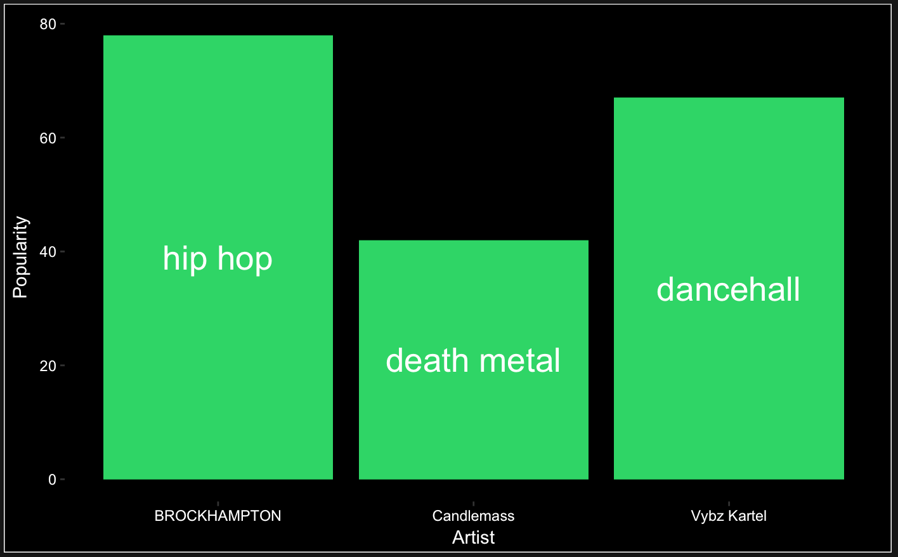
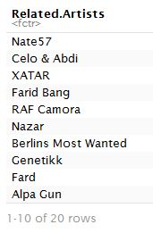
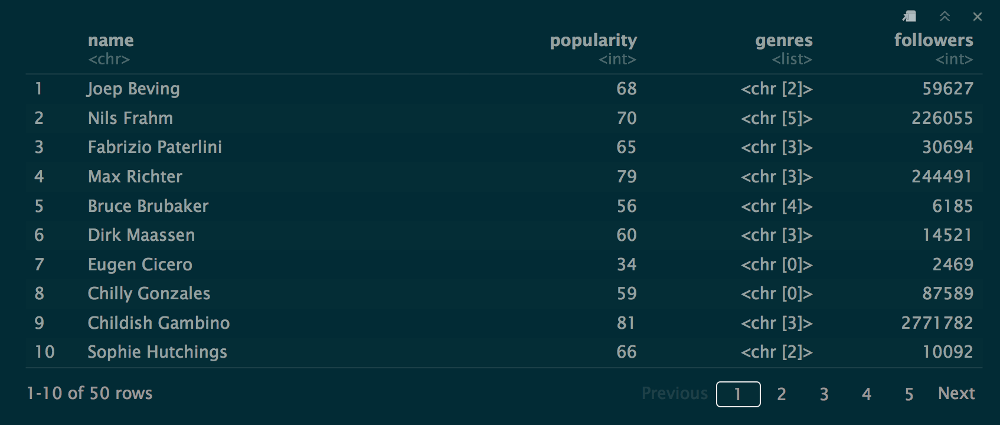

The `spotifyremoji` package is a wrapper package for the Spotify API.  


[](https://travis-ci.org/akleefel/spotifyremoji)

### Contributors

* Alexander Kleefeldt / @akleefel
* Charley Carriero / charcarr
* Daniel Raff / @raffrica
* Siobhan McCarter / @siobhanmccarter


### Summary

This is an R wrapper for the Spotify API.


### Functions

Three main functions in `spotifyremoji `:

- `compare_artists(user_auth_token, artist1, artist2, artist3)`:
	- Produces a graph comparing the popularity of selected artists.
	- Arguments:
		- `user_auth_token`:  A string of a unique authentication token, which can be acquired using the steps listed below under *Authentication*.
		- `artist1`,`artist2`,`artist3`: Three strings of the names of artists the user wishes to compare.
	- Returns:
		- A `ggplot` output graph.
	- Example of use:
		- `compare_artists(my_token, 'vybz kartel’, 'candlemass', 'brockhampton')`
		- Output:
		-       


- `related_artists(user_auth_token, artistName)`:
	- Prints a dataframe of an artist's related artists.
	- Arguments:
		- `user_auth_token`:  A string of a unique authentication token, which can be acquired using the steps listed below under *Authentication*.
		- `artistName`: A string identifying an artist of which the user wishes to find similar artists
		- Returns: A dataframe of the artist's related artists.
		- Example of use:
			- `related_artists(my_token, 'Haftbefel')`
			- Output:

			

- `get_top_artists_for_user(user_auth_token, limit_num, time_range_opt)`:
	- Finds a users top artists over an input time range. Returns a dataframe containing summary information on each artist.
	- Arguments:
		- `user_auth_token`:  A string of a unique authentication token, which can be acquired using the steps listed below under *Authentication*.
		- `limit_num`: An integer between 1 and 50 (inclusive), specifying the number of 'top artists' to return.  
		- `time_range_opt`: an integer, either 1,2 or 3
			- 1 = `long_term` is last several years of data
			- 2 = `medium_term` is last 6 months
			- 3 = `short_term` last 4 weeks
		- Returns: A dataframe of artist names, popularity, genres, and followers corresponding to the top artists of a user.  
		- Example of use:
			- `get_top_artists_for_user(my_token, 50, 2)`
			- Output:

			


### Authentication

All of our functions require an authentication token. For more information on how to set up an authentication token please see [Spotify Docs](https://beta.developer.spotify.com/documentation/general/guides/authorization-guide/).   

We have two easier options for users of this package to be able to provide the authentication tokens (the harder option is to read the [authorization guide](https://beta.developer.spotify.com/documentation/general/guides/authorization-guide/) and set it up).

Option 1:
> 1. Login to [Spotify for Developers](https://beta.developer.spotify.com/dashboard/) and Create an Client ID.
> 2. Click on `Web Console`, then pick an API call to explore. For instance click `Personalization` and then click on the `Get User's Top Artists and Tracks` end-point. Or can just click: [https://beta.developer.spotify.com/console/get-current-user-top-artists-and-tracks/](https://beta.developer.spotify.com/console/get-current-user-top-artists-and-tracks/).
> 3. Scroll down and click `GET TOKEN` under the OAuth Token Heading. Copy this string to your clipboard and use it with the above functions.  


Option 2:
> 1. Login to [Spotify for Developers](https://beta.developer.spotify.com/dashboard/) and Create an Client ID.
> 2. Link to Jordan Roth's Repo:
> 3. Instructions for how to generate a local app.  

Option 3:
> Develop your own Web App for Authorization following the Spotify Guides linked above.  

### Installation and examples:
To install the package:
```
devtools::install_github("akleefel/spotifyremoji")
```

EXPLANATION

```
library(spotifyremoji)

```

Important: In order for the tests to run successfully, one must open `.Renviron` and update the `SPOTIFY_TOKEN` to an active working token. This can be referenced with the command `Sys.getenv("SPOTIFY_TOKEN")`. Once the `.Renviron` file has been updated a **new Rstudio session** must be started for it to update appropriately.  


### Similar packages

[Rspotify](https://github.com/tiagomendesdantas/Rspotify)

[SpotifyR](https://github.com/charlie86/spotifyr)

### License
[MIT License](https://github.com/akleefel/spotifyremoji/blob/master/LICENSE)

### Contributing
This is an open source project. Therefore, feedback, suggestions, and contributions are very welcome. For feedback and suggestions, please open an issue in this repo. If you are willing to contribute this package, please refer to [Contributing](https://github.com/akleefel/spotifyremoji/blob/master/CONTRIBUTING.md) guidelines for details.
